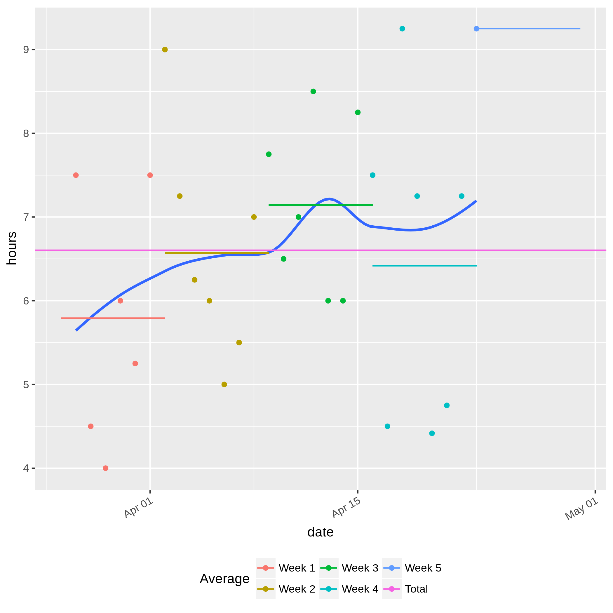

# timegraph
Visualize the amount of time spent on an activity.

## Dependencies

Requires R, the [tidyverse](https://github.com/tidyverse/tidyverse), and
[argparse](https://github.com/trevorld/argparse).

## Usage

```bash
# run the script:
Rscript timegraph.R my.csv

# alternatively:
./timegraph.R my.csv
```

This produces two files in the current directory, `bars.png` and `averages.png`,
based on the data in the CSV file.

### bars.png

Creates a floating box plot based on the data.
Each bar starts and ends at the respective times denoted in the CSV.
The bar is red when it is shorter than the average number of hours, and cyan
when it is longer.

### averages.png

Plots each point in the CSV, calculating duration as `end - start`.
Draws a smooth trend line through the points, and adds horizontal line segments
representing the average for each week.
A horizontal line representing the average over all weeks is also drawn.

## Example

`example.csv` includes data representing the amount of time spent sleeping on a
given day, relative to midnight.
For instance, on March 27, the user went to sleep at 23:00 and woke up at 06:30
the following day.
The plots for this set of data are shown below (click to enlarge):

<p float="left">
    
    
</p>

